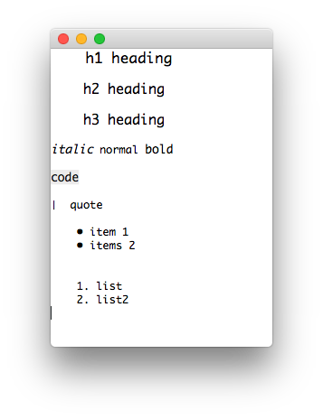

# GtkMarkdownTextView

[](https://github.com/JuliaGtk/GtkMarkdownTextView.jl/actions/workflows/CI.yml)
[](https://coveralls.io/github/jonathanBieler/GtkMarkdownTextView.jl?branch=master)

A widget to display simple markdown formatted text:



```julia
using Gtk4, GtkMarkdownTextView

w = GtkWindow("")

md = """
# h1 heading
## h2 heading
## h3 heading
*italic* normal **bold**

    code

> quote

- item 1
- items 2

1. list
2. list2

"""

v = MarkdownTextView(md)
push!(w,v)
show(w)
```

The constructor can take a prelude text and color settings :

```julia
MarkdownTextView(m::String, prelude::String, mc::MarkdownColors = MarkdownColors())
```

The color settings are defined as :

```julia
struct MarkdownColors
    font_size::Int
    color::String
    background::String
    highlight_color::String
    highlight_background::String
end

# default values
MarkdownColors() = MarkdownColors(13, "#000", "#fff", "#111", "#eee")

```
